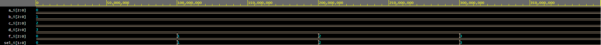

# Lab 3: INSERT_YOUR_FIRSTNAME INSERT_YOUR_LASTNAME

### Three-bit wide 4-to-1 multiplexer

1. Listing of VHDL architecture from source file `mux_3bit_4to1.vhd`. Always use syntax highlighting, meaningful comments, and follow VHDL guidelines:

```vhdl
architecture Behavioral of mux_3bit_4to1 is
begin

    library ieee;
use ieee.std_logic_1164.all;

------------------------------------------------------------
-- Entity declaration for mux
------------------------------------------------------------
entity mux_3bit_4to1 is
    port(
        a_i           : in  std_logic_vector(2 downto 0);
        b_i           : in  std_logic_vector(2 downto 0);
        c_i           : in  std_logic_vector(2 downto 0);
        d_i           : in  std_logic_vector(2 downto 0);
        f_i           : out  std_logic_vector(2 downto 0);
        sel_i         : in  std_logic_vector(1 downto 0)
    );
end entity mux_3bit_4to1;

------------------------------------------------------------
-- Architecture body for MUX
------------------------------------------------------------
architecture Behavioral of mux_3bit_4to1 is
begin
    with sel_i select
    f_i <= a_i when "00",
    	 b_i when "01",
    	 c_i when "10",
    	 d_i when others;
end architecture Behavioral;


end architecture Behavioral;
```

2. Screenshot with simulated time waveforms. Always display all inputs and outputs (display the inputs at the top of the image, the outputs below them) at the appropriate time scale!

   

3. Listing of pin assignments for the Nexys A7 board in `nexys-a7-50t.xdc`. **DO NOT list** the whole file, just your switch and LED settings.

```shell
##Switches
set_property -dict { PACKAGE_PIN J15   IOSTANDARD LVCMOS33 } [get_ports { a_i[0] }]; #IO_L24N_T3_RS0_15 Sch=sw[0]
set_property -dict { PACKAGE_PIN L16   IOSTANDARD LVCMOS33 } [get_ports { a_i[1] }]; #IO_L3N_T0_DQS_EMCCLK_14 Sch=sw[1]
set_property -dict { PACKAGE_PIN M13   IOSTANDARD LVCMOS33 } [get_ports { a_i[2] }]; #IO_L6N_T0_D08_VREF_14 Sch=sw[2]
set_property -dict { PACKAGE_PIN R15   IOSTANDARD LVCMOS33 } [get_ports { a_i[3] }]; #IO_L13N_T2_MRCC_14 Sch=sw[3]
set_property -dict { PACKAGE_PIN H6    IOSTANDARD LVCMOS33 } [get_ports { b_i[0] }]; #IO_L24P_T3_35 Sch=sw[12]
set_property -dict { PACKAGE_PIN U12   IOSTANDARD LVCMOS33 } [get_ports { b_i[1] }]; #IO_L20P_T3_A08_D24_14 Sch=sw[13]
set_property -dict { PACKAGE_PIN U11   IOSTANDARD LVCMOS33 } [get_ports { b_i[2] }]; #IO_L19N_T3_A09_D25_VREF_14 Sch=sw[14]
set_property -dict { PACKAGE_PIN V10   IOSTANDARD LVCMOS33 } [get_ports { b_i[3] }]; #IO_L21P_T3_DQS_14 Sch=sw[15]


## LEDs
set_property -dict { PACKAGE_PIN U17   IOSTANDARD LVCMOS33 } [get_ports { B_less_A_o }]; #IO_L17P_T2_A14_D30_14 Sch=led[6]
set_property -dict { PACKAGE_PIN U16   IOSTANDARD LVCMOS33 } [get_ports { B_equals_A_o }]; #IO_L18P_T2_A12_D28_14 Sch=led[7]
set_property -dict { PACKAGE_PIN V16   IOSTANDARD LVCMOS33 } [get_ports { B_greater_A_o }]; #IO_L16N_T2_A15_D31_14 Sch=led[8]
...
```
